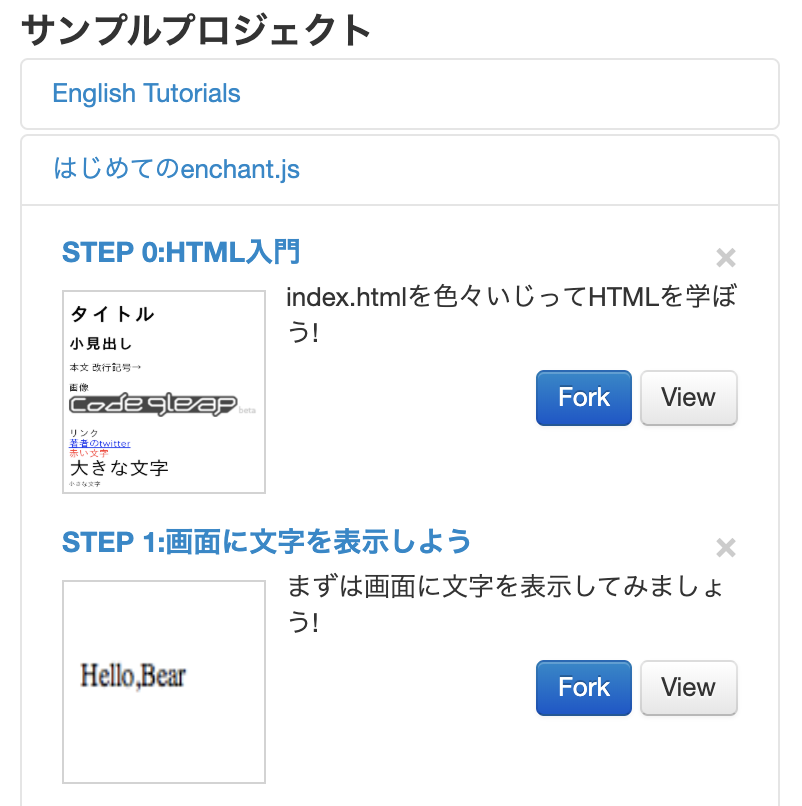

# enchant.jsを体験してみよう！

まずは***enchant.js***（えんちゃんとじぇいえす）がどういったものかを体験してみましょう。
  
enchant.jsが手軽に体験できる ***code9leap***（こーどないんりーぷ）というツールを使って動かしてみたいと思います。

 

## code9leap利用手順

1. [code9leap](http://code.9leap.net/) にアクセスしてください
2. 新規登録ボタンをクリックしてアカウントを作成します
3. ユーザーIDとパスワードを入力してログインします  

 

## code9leapの使い方

1. 左の ***サンプルプロジェクト*** から ***はじめてのenchant.js*** を選びます
2. ***STEP1:画面に文字を表示しよう*** の ***Fork*** ボタンをクリックします（Forkはコピーの意味）
3. ***Run*** ボタンをクリックすると、左下に ***課題1*** が表示されます
4. 右枠のプログラム ***hello.x=10*** を ***hello.x = 50*** に書き換えて、 ***Command+S***（保存）を押します
5. うまくプログラムが修正できていると次の課題が現れます。
6. 全て課題が終わったら ***Finish*** ボタンをクリックして終了です。

 

## カリキュラム

***はじめてのenchant.js*** より、 ***STEP1*** から ***STEP8*** までの体験課題をやってみましょう！  
  
1. STEP 1:画面に文字を表示しよう
2. STEP 2:スプライトを表示しよう
3. STEP 3:スプライトがタップされたら絵が変化するようにしてみよう
4. STEP 4:スケボーにのったクマさんを動かしてみよう
5. STEP 5:クラスを使って沢山のクマさんを表示してみよう
6. STEP 6:クマさんの行進
7. STEP 7:クマさんを操作しよう
8. STEP 8:クマさんのフルーツ狩り

 

## おわりに

8つのステップでなんとなくenchant.jsの雰囲気がつかめたのではないでしょうか！？  
次回から実践編としてサンプル課題をやっていきましょう。  

 

- - -  
©️スタートプログラミング  
  