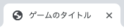
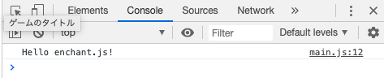

# enchant.js（えんちゃんとじぇいえす）とは？

これから`enchant.js`を本格的に学んでいきます。  
まずはenchant.jsについての解説と、ゲームを開発していくための環境を構築していきます。  

## 概要
### JavaScriptゲームフレームワーク

enchant.jsは`JavaScript`（じゃばすくりぷと）というプログラミング言語で書かれた`ゲームフレームワーク`です。  
`フレームワーク`とは、あらかじめ用意された便利な機能が使えるパッケージのことで、enchant.jsは簡単なプログラミングで本格的なゲームが開発できるようになっています。  

### マルチプラットフォーム
  
enchant.jsは`マルチプラットフォーム`（パソコンやスマートフォンなど様々な機器に対応することができる）であることが特徴です。    
これまで`スクラッチ`や`マインクラフト`で作ったプログラムはそれぞれのサービスでしか動きませんでしたが、enchant.jsではいろんな機器で動作します。  
enchant.jsでゲームを作るだけで`Chrome`（くろーむ）などのパソコンブラウザから、iPhoneやAndroidなどスマートフォンなどでも動くようになります。  

### 公式サイト  
  
enchant.jsの[公式サイト](http://enchantjs.com/)を見てみましょう。   
enchant.js本体のダウンロードができたり、APIドキュメント（便利な関数の使い方や意味が掲載されているページ）などが確認できます。  

※ 2019/10/07時点で公式サイトがダウンしています。ソースのダウンロードやAPIリファレンスの参照は直接以下にアクセスしてください。

[ソースコード（本体）](https://github.com/uei/enchant.js-builds)  
[ソースコード（サンプル）](https://github.com/wise9/enchant.js)  
[APIリファレンス](http://wise9.github.io/enchant.js/doc/core/ja/index.html)  
[APIリファレンス（プラグイン付き）](http://wise9.github.io/enchant.js/doc/plugins/ja/index.html)  
  
### プログラミング言語  

enchant.jsで扱うプログラミング言語は、一般的にホームページを制作する時に使うWebのプログラミング言語を使います。  
学習カリキュラムでは以下のような3つのプログラミング言語が出てきますが、基本的にはJavaScriptのみ使用します。  
  
- HTML（えいちてぃーえむえる）
- CSS（しーえすえす）
- JavaScript（じゃばすくりぷと）

### ツール  

enchant.jsアプリを開発するにあたって、以下の2点を使用します。  
PCにインストールされていない場合は、設定して進めてください。

- ブラウザ：Google Chrome（ぐーぐる　くろーむ）
- テキストエディタ：Visual Studio Code（びじゅある　すたじお　こーど）
  
[Google Chromeダウンロード](https://www.google.com/intl/ja_jp/chrome/)  
[Visual Studio Codeダウンロード](https://azure.microsoft.com/ja-jp/products/visual-studio-code/)  

---  

## 環境構築

1. 任意のフォルダを作成  
ゲームのソースコードを保存するためのマイフォルダを作成してください。  

2. テンプレートのコピー  
教材パッケージに含まれる`template`フォルダをコピーします。  

3. ゲームタイトルを設定  
`template`フォルダからコピーした中に`index.html`というファイルがあります。  
`index.html`を`VisualStudioCode`で開き、以下の `ゲームのタイトル` 部分を変更します。  

    ```html
    <title>ゲームのタイトル</title>     
    ```  

4. ログを設定して正常動作を確認
コピーしたプログラムが正常に動作するか確認しましょう。  
ログを出力するプログラムを書いて、次のステップで実行します。  
  
    ```javascript
    core.onload = function() {
        console.log('Hello enchant.js!');   // 追加
    };
    ```

5. アプリを実行する  
enchant.jsのアプリの実行（スクラッチでいう緑のハタ）は `index.html` をダブルクリックし、ブラウザで起動します。  
`index.html` をダブルクリックするとブラウザが起動し、以下の2点が表示されていれば成功です。  

    - タブの表示  
    ブラウザのタブに以下のようなゲームのタイトルが表示されていること。  
    

    - ログの出力  
    `検証/Console` に入力したメッセージが表示されていること。  
    


これでenchant.jsを学ぶ準備ができました。  
次回から本格的にプログラムを書いてenchant.jsでゲームを作ってみましょう。  

- - -  
©️スタートプログラミング  
  