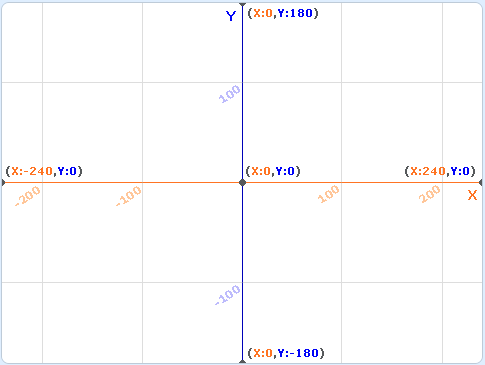
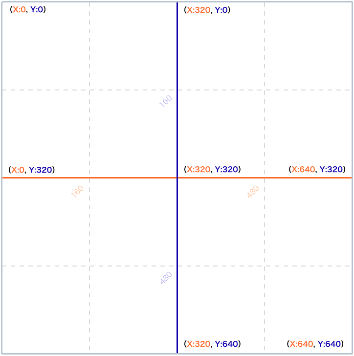
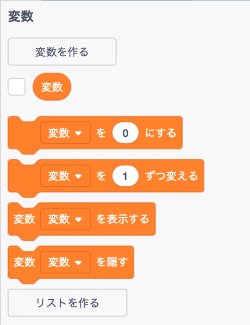

# 基本を理解しよう！  

enchant.jsの開発環境の構築ができたところで、まずはenchant.jsで出てくる用語の意味や役割について学んでいきましょう。  
また、ゲームの仕様やJavaScriptでプログラミングする上での作法について学びます。  

## このカリキュラムのねらい  

- enchant.js特有のさまざまな用語を学びます  
- ゲーム仕様の概念を学びます  
- JavaScriptプログラミング作法を学びます  

## enchant.js用語解説

enchant.jsでは、スクラッチやマインクラフトにはなかった用語や役割を持つ仕組みが出てきます。  
ゲームを開発する上でとても大切なので、それぞれ理解してから進めていきましょう。  

- Core（コア）  
ゲームの本体を表します。  
`コアオブジェクト`などと呼びますので覚えましょう。  
ゲーム画面のサイズを決めたり、ゲーム全体の開始や終了など、ゲーム機のような役割をします。  
  
- Scene（シーン）  
ゲームの画面単位をシーンといいます。  
初期画面は `rootScene`（ルートシーン）というシーンが `Core` に用意されており、ゲームが開始する最初の画面は必ず `rootScene` から始まります。  
  
- Sprite（スプライト）  
スクラッチと同じくキャラクター（登場人物）のことを `Sprite`（スプライト）と呼びます。  

- FPS（エフピーエス）  
1秒間あたりの画面更新回数のことをFPSと言います。  
何も設定しなければ通常1秒間あたり60回の更新をしていますが、例えば30回など減らすことでゲーム全体のスピードを制御することができます。  

- Class（クラス）  
クラスは簡単に言うと設計図のようなものです。  
スクラッチではスプライトをクローンすることができましたが、enchant.jsではスプライトをクローンすることはできず、同じようなスプライトをいくつもクローンする場合は、クラスとしてクローンの設計図を作成しその後クローンすることができるようになります。  
クラスはクローンをするための設計図だと覚えましょう。  

- Label（ラベル）  
ラベルは文字を表示するためのスプライトです。  
文字サイズや文字の色なども設計することができます。  

## enchant.jsゲーム仕様

### 座標の考え方  
スクラッチでは画面中心の座標が（x:0, y:0）でしたが、enchant.jsでは左上の座標が（x:0, y:0）となります。  
また、X座標・Y座標ともに -（マイナス）の概念はなく、右にいくとX座標をプラス、下にいくとY座標をプラスすることになります。  
  
さらに、スクラッチは画面の最大がX座標は「-240 〜 +240」、Y座標は「-180 〜 +180」でしたが、enchant.jsでは最大640として自由に画面のサイズを決めることができます。  

- スクラッチの座標  
  
  
- enchant.jsの座標  
  
    
### JavaScriptプログラミングの基礎  

enchant.jsでは`JavaScript`（じゃばすくりぷと）というプログラミング言語を使います。  
タイピングによるプログラミングとなりますが、マインクラフトと書き方が異なる箇所がたくさんありますので、一つ一つ覚えていきましょう。  

- 変数  
        
    enchant.jsでも`スクラッチ`と同じように変数が使えます。  
    変数であることを宣言するために、変数を定義する時には `var` を記述します。  
    宣言と同時に値を代入することもできます。  

    ```javascript
    /* 
        文法）
        var 変数名;
    */
    var data = 0;       // 整数の変数
    var list = [];      // 配列の変数
    ```
　　
- 定数  
    定数とは、変数のようにデータを入れる箱ですが、変数と違い宣言時に入力した値の変更ができないのが特徴です。  
    定数であることを宣言するために、定数を定義する時には `const` を記述します。  
    宣言後は代入ができないので、宣言と同時に値を代入します。  

    ```javascript
    /* 
        文法）
        const 変数名;
    */
    const data = 0;
    ```  

    #### 定数の使用例
    定数は消費税（8%=>10%）など、特定の値を多くの箇所で利用するにも関わらず、将来変更される可能性があるものに利用します。  
      
    例）定数利用前
    ```javascript
    var penclil = 100;  // 鉛筆
    var eraser = 50;    // 消しゴム
    console.log('鉛筆は' + (pencil * 1.08) +'円です');
    console.log('消しゴムは' + (eraser * 1.08) +'円です');
    ```  

    例）定数利用後
    ```javascript
    const TAX = 1.1;    // 消費税
    var penclil = 100;  // 鉛筆
    var eraser = 50;    // 消しゴム
    console.log('鉛筆は' + (pencil * TAX) +'円です');
    console.log('消しゴムは' + (eraser * TAX) +'円です');
    ```  

    上記のようにプログラムしておくことで、同じ数値を何箇所も修正する必要がなくなります。  

- コメント  
    ソースコードにはプログラムに影響しないコメントを記述することができます。  
    コメントはの書き方は2種類あります。  

    ```javascript
    // 1行コメント
    /* 
        複数行のコメント
    */
    ```

enchant.jsの用語とJavaScriptプログラミングの基礎の導入部分はここまでです。  
次回からはプログラミングを実践しながら、もう少し基本を学習していきましょう。  

- - -  
©️スタートプログラミング  
