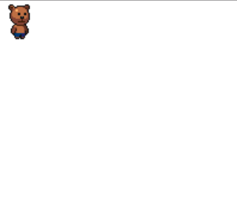
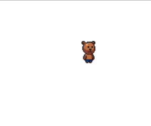
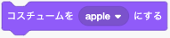
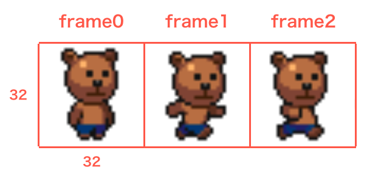

# スプライトを表示してみよう！  

いよいよここからは実際にプログラミングを実践しながら、基本的なenchant.jsゲームプログラミングを学んでいきましょう。 

## このカリキュラムのねらい  

- ゲーム画面の生成と開始について学びます
- スプライトの生成と表示について学びます  

## はじめてのenchant.jsプログラミング  

### ゲーム画面の生成とゲームの開始
ゲームを開始するには必ず `Core` オブジェクトを生成する必要があります。  
引数に画面サイズ（X座標, Y座標）を渡すので、下記の場合は640×640の画面サイズを持ったゲームが作成されます。  

```javascript
// ゲーム画面の生成
var core = new Core(640, 640);
// ゲームスタート
core.start();
// ゲームの処理
core.onload = function() {
    // ここにゲームの処理を書く
}
```  
※ ゲーム画面の最大値は640です。  
※ 上記コードはすでにテンプレートに書いてあるので新たに記入する必要はありません。  
  
### スプライトの生成と表示

スプライトの表示は画像の読み込みと、スプライトの生成処理が必要となります。  

- ゲームに画像を読み込む
```javascript
// クマの画像を読み込む
core.preload('bear.png');
```

- スプライトを生成し、ゲーム画面に登録する
```javascript
// スプライトを生成（32×32の大きさ）
var bear = new Sprite(32, 32);
// スプライトに画像を設定する
bear.image = core.assets['bear.png'];
// ルートシーンにクマのスプライトを登録する
core.rootScene.addChild(bear);
```

完成するとこのようにクマの画像が表示されます。  
  

#### スプライトの位置を変更する  
スプライトは座標を指定することで位置を変更することができます。  

スクラッチでは、下記のブロックを使っていた部分です。  
  
  
```javascript
bear.x = 100;
bear.y = 50;
```

完成するとクマの位置が移動します。  
  

### スプライトのコスチュームの切り替え  

スクラッチではスプライトの見た目は`コスチューム`を変えることで変更されました。  
  

enchant.jsではコスチュームではなく、画像の中の位置を移動すること（`frame: フレーム`）で見た目を変更します。  
  

フレームは左上を0とし、1、2と切り替えることで、左上から32ずつずらして読み込まれます。  

```javascript
bear.frame = 2;
```

完成するとクマの見た目が3つ目の絵に変わります。  
  
  
## 完成プログラム

```javascript
// enchant.js利用宣言
enchant();

// JavaScriptプログラム実行
window.onload = function() {

    // ゲーム画面生成
    var core = new Core(640, 640);
    core.preload('bear.png');
    // ゲーム開始宣言
    core.start();
    // ゲーム実行
    core.onload = function() {
        // スプライトを生成
        var bear = new Sprite(32, 32);
        // スプライトの初期位置を設定
        bear.x = 100;
        bear.y = 50;
        // スプライトのコスチュームを設定
        bear.frame = 2;
        // スプライトにクマの画像を設定
        bear.image = core.assets['bear.png'];
        // ルートシーンにクマのスプライトを登録
        core.rootScene.addChild(bear);
    };
};
```

- - -  
©️スタートプログラミング  
