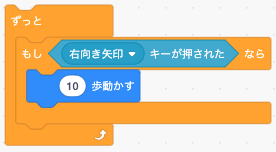

# スプライトを動かしてみよう！  

スプライトの表示を学んだので、今度はスプライトを動かしてみましょう。  

## このカリキュラムのねらい  

- スプライトのいろいろな動かし方を学びます   
- キーが押された時に処理をする方法を学びます  
- 音を出す方法を学びます  

## いろいろなスプライトの操作    

### スプライトの移動  

スプライトの移動は繰り返し中で座標の変更をすることで、移動をさせているように見せます。  
基本的にはスクラッチの `ずっと` と `？歩動かす` と同じ考え方です。  
  

```javascript
// スプライトの繰り返し処理
bear.on('enterframe', function() {
    // X座標を右に移動
    this.x += 5;
});
```

`bear.on('enterframe', function(){ });`で、functionの中に書かれたプログラムがずっと繰り返し実行されます。  
`this` とは `bear` のことをさし、`+=` とすることで、`this.x = this.x + 5;` と同じ意味になります。  

実行すると、クマのスプライトが5ずつ右に移動します。  

### スプライトの回転  
スプライトはスクラッチと同じように回転させることができます。  
  

スプライトの角度を回転させるには、`rotation`を使います。 
右上45度に傾ける指定は以下の通りです。  
```javascript
bear.rotation = -45;
```

### キーが押されたらスプライトを動かす  

次はキーが押されたらスプライトを動かすようにしてみましょう。  
  
右キーが押されたらクマスプライトを右に5づつ移動させます。  

```javascript
// スプライトの繰り返し処理
bear.on('enterframe', function() {
    // 右キーが押された    
    if(core.input.right) {
        // X座標を右に移動
        this.x += 5;
    }
});
```

`core.input.right` は右キーが押されている間だけ `true` になり、X座標を+5する動きになります。  
`core.input.left` は左キーが押されたことを判断することができます。  

### スペースキーが押されたら音を鳴らす  

- スペースキーの登録  
スペースキーは `core.input.space` で判断することができそうですが、enchant.jsでは最初からスペースキーが押されたことを判断することができない仕様となっています。  
しかし、coreオブジェクトに特殊な設定をすることで、スペースキーを判断することができるようになります。  

    ```javascript
    // スペースキーの利用設定
    core.keybind(32, "space");
    ```

- 音を鳴らす  
あらかじめ用意された音ファイル `jump.wav` を使ってスペースキーが押されたら音を鳴らしてみましょう。  
  

音を鳴らすには画像と同じく最初にcoreオブジェクトに音ファイルを読み込みをさせる必要があります。  

    ```javascript
    // 画像と音の読み込み
    core.preload('bear.png', 'jump.wav');
    ```

    ```javascript
    // スプライトの繰り返し処理
    bear.on('enterframe', function() {
        // スペースキーが押された    
        if(core.input.space) {
            // ジャンプの音を鳴らす
            core.assets['jump.wav'].clone().play();
        }
    });
    ```

スペースキーを押すとジャンプ音が鳴るようになりました。

## 完成プログラム

```javascript
// enchant.js利用宣言
enchant();

// JavaScriptプログラム実行
window.onload = function() {

    // ゲーム画面生成
    var core = new Core(640, 640);
    // 画像と音の読み込み
    core.preload('bear.png', 'jump.wav');
    // スペースキーの利用設定
    core.keybind(32, "space");
    // ゲーム開始宣言
    core.start();
    // ゲーム実行
    core.onload = function() {
        // スプライトを生成
        var bear = new Sprite(32, 32);
        // スプライトの初期位置を設定
        bear.x = 100;
        bear.y = 50;
        // スプライトの角度を設定
        bear.rotation = -45;
        // スプライトのコスチュームを設定
        bear.frame = 2;
        // スプライトにクマの画像を設定
        bear.image = core.assets['bear.png'];
        // スプライトの繰り返し処理
        bear.on('enterframe', function() {
            // 右キーが押された
            if(core.input.right) {
                // クマのスプライトを右に移動
                this.x += 5;
            }
            // スペースキーが押された    
            if(core.input.space) {
                // ジャンプの音を鳴らす
                core.assets['jump.wav'].clone().play();
            }
        });
        // ルートシーンにクマのスプライトを登録
        core.rootScene.addChild(bear);
    };
};
```

- - -  
©️スタートプログラミング  
