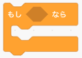
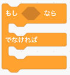
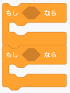

# JavaScriptプログラミングの基礎2  

複雑な処理をするには条件分岐や繰り返し、関数などを使ってプログラミングすることが必要になります。  
スクラッチを例にプログラムの書き方を学びましょう。  

## このカリキュラムのねらい  

- 条件分岐文の書き方を学びます  
- 比較演算子の書き方と意味を学びます  
- 論理演算の書き方と意味を学びます  
- 繰り返し文の書き方を学びます  
- 関数の書き方を学びます  
- 変数の有効範囲を学びます    

--- 

## JavaScriptプログラミング

### 条件分岐文  

条件分岐（じょうけんぶんき）とは、プログラムの中である条件が満たされているかどうかによって次に実行するプログラムのことをいいます。   
スクラッチをベースに説明します。  

- if（もし 〜 なら）  
  
  
    ```javascript
    // もし 〜 なら
    if (条件) {
        // 処理
    }
    ```  

- else（もし 〜 なら、でなければ）  
    
   
    ```javascript
    // もし 〜 なら
    if (条件) {
        // 処理
    }
    // でなければ
    else {
        // 処理
    }
    ```  
    
- else if（もし 〜 なら、もし 〜 なら）   
   
   
    ```javascript
    // もし 〜 なら
    if (条件) {
        // 処理
    }
    // もし 〜 なら
    else if (条件) {
        // 処理
    }
    ```  

### 比較演算子  

コンピュータの世界では、計算のことを演算（えんざん）と呼びます。  
比較演算子は、2つの対象の関係を比較した結果を真偽値（true または false）で返却します。  

- 〜より大きい、〜より小さい  
  
    
       
   

    ```javascript
    var a = 1;
    var b = 0;
    
    // aはbよりおおきい
    result = a > b;
    concole.log(result);    // true

    // bはaよりおおきい
    result = b > a;
    concole.log(result);    // false
    
    // aはbよりちいさい
    result = a < b;
    concole.log(result);    // false

    // bはaよりちいさい
    result = b < a;
    concole.log(result);    // true
    ```  

- 〜以上、〜以下  
    ※ スクラッチに該当するブロックなし  

    ```javascript
    var a = 1;
    var b = 0;
    
    // aはb以上
    result = a >= b;
    concole.log(result);    // true
    
    // bはa以上
    result = b >= a;
    concole.log(result);    // false

    // aはb以下
    result = a <= b;
    concole.log(result);    // false

    // bはa以下
    result = b <= a;
    concole.log(result);    // true
    ```  

- 〜同じ、〜同じではない

    
       

    ```javascript
    var a = 1;
    var b = 0;
    
    // aとbは同じ
    result = a == b;
    concole.log(result);    // false
    
    // aとbは同じではない
    result = a != b;
    concole.log(result);    // true
    ```  

### 論理演算  
  
論理演算（ろんりえんざん）とは、ある論理式において正しい「真（しん）：true」か、正しくない「偽（ぎ）：false」を判断する計算式になります。  

- 論理積（AND：あんど）  
   
どちらの条件式も真（true）になったら `{ }` の中の処理を行います。  
どちらかが偽（false）の場合は `{ }` の中の処理は行われません。  

    ```javascript
    // かつ
    if (条件式 && 条件式) {
        // 処理
    }
    ```  

    ```javascript
    var a = 1;
    var b = 1;
    var c = 2;

    // どちらもtrue
    if ( a == b && b <= c) {
        // 処理は実行される
    }

    // a != b は false
    if ( a != b && b <= c) {
        // 処理は実行されない
    }
    ```  

- 論理和（OR：おあ）  
   

    どちらかの条件式が真（true）になったら `{ }` の中の処理を行います。  
    どちらも偽（false）の場合は `{ }` の中の処理は行われません。  
      
    ```javascript
    // または
    if (条件式 || 条件式) {
        // 処理
    }
    ```  

    ```javascript
    var a = 1;
    var b = 1;
    var c = 2;
    
    // a == b は true
    if ( a == b && b == c) {
        // 処理は実行される
    }

    // a != b も b == c どちらもfalse
    if ( a != b && b == c) {
        // 処理は実行されない
    }
    ```  

- 否定（NOT：のっと）  
   

    否定（NOT）の論理演算では真の場合は偽、偽の場合は真に条件式の評価が反転します。  

    よって、条件式が偽（false）の場合は `{ }` の中の処理を行います。  
    条件式が真（true）の場合は `{ }` の中の処理は行われません。  
      
    ```javascript
    // 否定
    if (　!(条件式) ) {
        // 処理
    }
    ```  

    ```javascript
    var a = 1;
    var b = 1;
    
    // a == b は true
    if ( !(a == b) ) {
        // 処理は実行されない
    }

    // a != b は false
    if ( !(a != b) ) {
        // 処理は実行される
    }
    ```  

### 繰り返し文  

- ？回繰り返す  
   
  
    ```javascript
    // 10回繰り返す
    for(var i = 0; i < 10; i++) {
        // 繰り返す処理
    }
    ```  

    変数iを0から1つづつ足して、10回まで繰り返す処理です。  
    それぞれ以下の意味になります。  
    ```
    初期値： var i = 0;  
    条件式： i < 10;  
    増減値： i++;  
    ```  

### 関数  
   

実行したいいくつかのプログラムをまとめて定義できるのが関数です。  
スクラッチではブロックとして用意されていました。  

文法） 
```
function 関数名(引数名) {
    return 返却値;
}
```

乱数（ランダムな値）を取得するための関数の例です。  
与えられた引数までの乱数を計算して、呼び出し元に返します。  

```javascript
function random(num) {
    var data = (numを乱数に計算);
    return data;
}
console.log(random(100));
```  
  
スクラッチと違い、関数には返却値として値を返すことができます。  
  
### 変数の有効範囲    
JavaScriptには変数の有効範囲があります。  
有効範囲を示す `{}` のことを `スコープ` といいます。  

```javascript
var a = 1;
if (true) {
    var b = 2;
    // この処理は成功する
    console.log(a+b);
}
// この処理はエラーとなる
console.log(a+b);
```

変数aはスコープの外にあるため最後のログ出力で計算できますが、変数bはif文の中までしか有効ではありません。  
そのため、スコープ外から変数bを呼びだすため、エラーとなりプログラムが止まってしまいます。  
  
変数の有効範囲は `{}`（スコープ）となることを覚えておきましょう。  

- - -  
©️スタートプログラミング  
