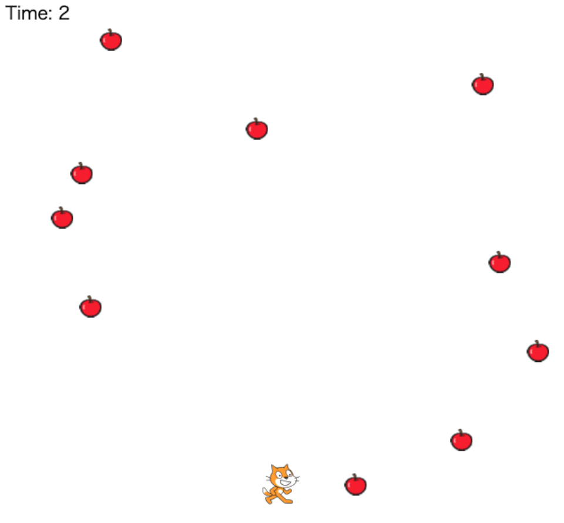
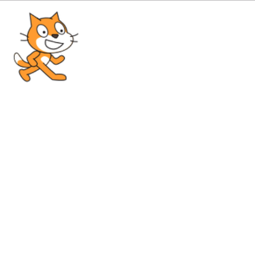
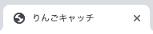

# りんごキャッチ01：環境構築

ここからはスクラッチで作った「りんごキャッチ」ゲームを練習課題として、`enchant.js`を学んでいきます。  
まずは開発するための環境を作ってしましょう。  
このカリキュラムの最後には以下のようなゲームが完成します。  


  
## このカリキュラムのゴール  
  
- ゲームを作るための環境の作り方を学びます  
- ネコのスプライトを作り表示します  

このカリキュラムを終えると以下のような表示になります。  
  


## 環境構築

まずはゲームを開発するための環境を構築していきます。  

1. ダウンロード＆解凍  
公式サイトからenchant.js本体をダウンロードします。  
[ソースコード](https://github.com/wise9/enchant.js)  
  
2. 任意のフォルダを作成  

3. 解凍したフォルダからコピー  
解答したenchant.jsのフォルダから、作成した任意のフォルダに以下のファイルをコピーします。  
    ```
    /enchant.min.js  
    /examples/beginner/hellobear/index.html
    ```

4. 教材から素材をコピー  
画像と音声のファイルを任意のフォルダに以下をコピーしてください。  
    ```
    application/apple.png
    application/cat.png
    application/meow.wav
    ```

5. テキストエディタで main.js を作成し保存
新規で空のファイルを「main.js」という名前で作成します。

6. enchant.js定型文の実装
enchant.jsのお決まり定型文をmain.jsに書きます。
    ```javascript
    enchant();
    window.onload = function() {
        console.log('Hello!');
    }
    ```

7. `enchant.min.js`へのパスを設定  
`index.html`を開き、enchant.jsの読み込みのパスを修正し、enchant.jsが正しく動作するようにします。

    - 修正前
    ```html
    <script type="text/javascript" src="../../../build/enchant.js"></script>
    ```

    - 修正後
    ```html
    <script type="text/javascript" src="enchant.min.js"></script>
    ```

8. タイトルの設定
`index.html`を開き、ブラウザでゲームを起動した時にタブ部分にタイトルが表示されるよう修正します。  
    ```html
    <head>
        <meta name="apple-mobile-web-app-capable" content="yes">
        <title>りんごキャッチ</title>    <!-- この1行を追加 -->
        <script type="text/javascript" src="enchant.min.js"></script>
    </head>
    ```

9. `index.html`をダブルクリックしChromeを起動

10. タブに「りんごキャッチ」と表示されていることを確認
<br>

<br>

11. 検証でログを確認  
コンソールログで`"Hello!"`と表示されていれば成功です。

<br>

## ゲームの基本設定

続いてゲームとして動作させるための基本設定を行っていきます。  

1. coreオブジェクトを生成  
    ```javascript
    var core = new Core(640, 640);
    ```

2. ネコの画像を読み込み  
    ```javascript
    core.preload('cat.png');
    ```

3. ゲームの開始を実行  
    ```javascript
    core.onload = function() {
    }
    core.start();
    ```

4. ネコのスプライトを生成
    ```javascript
    var cat = new Sprite(100, 100);
    // 画像読み込み
    cat.image = core.assets['cat.png'];
    // X座標を10に設定
    cat.x = 10;
    // Y座標を10に設定
    cat.y = 10;
    ```

5. ネコのスプライトをルートシーンに登録
スプライトはシーンに登録することで表示されるようになります。  
生成したネコのスプライトをルートシーンに登録します。  
    ```javascript
    core.rootScene.addChild(cat);
    ```
  
全て入力できたら開発する土台のソースコードの完成です。  
次回からいよいよゲームの動きなど作っていきます。  
  
## main.js 完成品
```javascript
// enchant.jsの利用宣言
enchant();

// JavaScriptプログラムを実行する定型文
window.onload = function() {

// ゲーム画面の生成
    var core = new Core(640, 640);
    // ネコ画像の読み込み
    core.preload('cat.png');

    // ゲームの処理
    core.onload = function() {
        // ネコスプライトの生成
        var cat = new Sprite(100, 100);
        // ネコ画像の設定
        cat.image = core.assets['cat.png'];
        // ネコの初期座標を設定
        cat.x = 10;
        cat.y = 10;
        // ルートシーンにネコのスプライトを登録
        core.rootScene.addChild(cat);
    }
    // ゲームスタート
    core.start();
}
```

- - -  
©️スタートプログラミング  
  