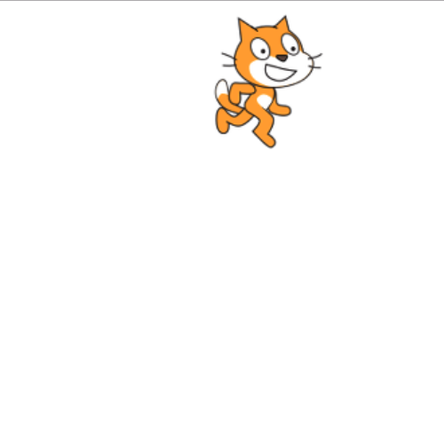

# りんごキャッチ02：ネコを動かしてみよう！

## このカリキュラムのゴール  
  
- スプライトの動かし方を学びます  

このカリキュラムを終えると以下のような表示になります。  
  

## ネコを動かしてみよう！

1. ネコを動かしてみよう  
 `on.('enterframe')`メソッドでネコを動かしてみましょう。  
今回は右方向に動かしてみます。
この場合、X座標に対して+10（右）づつネコが移動します。  

    ```javascript
    cat.on('enterframe', function(){
        this.x += 10;
    });
    ```
  
2. fpsを設定  
`fps`は、Frame Per Secound の略で、1秒あたりの画面の更新回数です。  
一般的にゲームだと60が設定されていますが、30などに変更することが可能です。  
何も設定しなければ、表示しているパソコンの処理速度に依存します。  
今回は30に設定してみました。  

    ```javascript
    core.fps = 30;
    ```
    上記の設定で1秒あたり、30回画面が更新されることになります。  
  
3. 画面の右端まで移動したら先頭に戻す
このままではネコはずっと右に移動してしまいます。  
画面の右端まで移動したら、左端まで移動して移動を繰り返すようにしてみます。  

    ```javascript
    cat.on('enterframe', function(){
        this.x += 10;
        if(this.x > 640) {
            this.x = 0;
        }
    });
    ```

4. ネコを歩かせる  
このままではネコはただ移動するだけで歩いているように見えません。
歩いているように見せるためには、スクラッチのようにコスチュームを交互に切り替えることで実現します。  
まずはスプライトの初期フレーム（コスチューム）を設定します。  

    ```javascript
    cat.frame = 0;
    ```  

    次に画面更新ごとにスプライトのフレームを切り替えます。  

    ```javascript
    cat.on('enterframe', function() {
        this.frame = this.age % 2;
        this.x += 10;
        if(this.x > 640) {
            this.x = 0;
        }
    });
    ```  

    `this.frame` はネコのフレーム（コスチューム番号）、`this.age` は `on.('enterframe')` の繰り返しのカウントを表します。  
    今回は画面の更新に合わせてコスチュームが切り替わるように設定しました。  

全ての完成コードは以下の通りです。  

---  

## main.js 完成品
```javascript
// enchant.jsの利用宣言
enchant();

// JavaScriptプログラムを実行する定型文
window.onload = function() {

    // ゲーム画面の生成
    var core = new Core(640, 640);
    // ネコ画像の読み込み
    core.preload('cat.png');
    // 画面更新間隔の設定
    core.fps = 30;

    // ゲームの処理
    core.onload = function() {
        // ネコスプライトの生成
        var cat = new Sprite(100, 100);
        // ネコ画像の設定
        cat.image = core.assets['cat.png'];
        // ネコの初期座標を設定
        cat.x = 10;
        cat.y = 10;
        // ネコの初期コスチュームを設定
        cat.frame = 0;
        // ネコの動き
        cat.on('enterframe', function() {
            // コスチュームの切り替え
            this.frame = this.age % 2;
            // 右に移動
            this.x += 10;
            // 右端まで移動したら
            if(this.x > 640) {
                // 左端に移動
                this.x = 0;
            }
        });
        // ルートシーンにネコのスプライトを登録
        core.rootScene.addChild(cat);
    }
    // ゲームスタート
    core.start();
}
```

- - -  
©️スタートプログラミング  
  