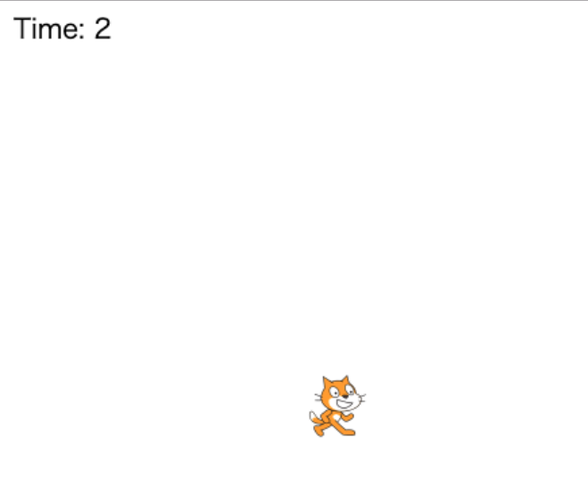

# りんごキャッチ04：時間を表示しよう！

## このカリキュラムのゴール  
  
- ラベルの説明と実装方法を学びます。  
- 定数について学びます。  
- ゲーム全体の動作について学びます。  
  
このカリキュラムを終えると以下のような表示になります。  
  

## 時間を表示しよう！

1. 時間の文字（ラベル）を表示します  
`Label（ラベル）`とは文字を表示するクラスです。  
ゲームの残り時間をラベルを使って表示します。  

    ```javascript
    var time = new Label();         // ラベル生成
    time.x = 10;                    // ラベルX座標初期位置
    time.y = 10;                    // ラベルY座標初期位置
    time.font = '20px Hiragino';    // 文字の大きさ（px：ピクセルは単位、Hiragino：種類）
    time.text = 'Time: ';           // 表示する文字
    core.rootScene.addChild(time);  // ルートシーンにラベルを登録
    ```

2. ゲームの時間を決めよう！  
りんごキャッチゲームではゲーム開始から10秒経過したらゲームオーバーとする動きにしたいと思います。  
まずは10秒という数字を定義しましょう。
この時、変数 `var` ではなく定数 `const` で宣言します。  
定数は一度定義するとプログラムの途中変更できない仕組みとなります。  
定数であることがわかるように、定数名はすべて大文字としてください。  

    ```javascript
    const TIME = 10;    // 10秒
    ```

3. ラベルの表示を更新しよう  
時間が経過する度にラベルの表示を切り替えて10秒からカウントダウンするように残り時間を表示してみます。  
カウントダウンは、ルートシーン全体の `on('enterframe')`メソッドを使って、時間の経過を取得し計算することで表示します。  

    ```javascript
    core.rootScene.on('enterframe', function() {
        time.text = 'Time: ' + ((((TIME * core.fps) - core.frame)) / core.fps).toFixed(0);
    });
    ```

    - `TIME * core.fps` : 10秒後のフレーム数  
    10秒とFPS（30）を掛け算することで10秒経過時の画面更新回数を取得します  

    - `core.frame` : 現在のフレーム数  
    ゲームが開始されてから経過した画面更新回数です  

    - `(TIME * core.fps) - core.frame)` : 残りのフレーム数  
    10秒経過後のFPSからゲームを開始してから経過したFPSを引くことで残りのFPSが計算されます  

    - `((TIME * core.fps) - core.frame)) / core.fps)`: 残りの時間  
    残りのフレーム数をFPSで割ることで、残り時間が計算されます　　

    - `toFixed(0)`: 小数点以下の切り捨て  
    計算した残りの時間から小数点以下の数値を切り捨てます  　
  
---

## main.js 完成品
```javascript
// enchant.jsの利用宣言
enchant();

// JavaScriptプログラムを実行する定型文
window.onload = function() {

    // ゲームの残り時間
    const TIME = 10;

    // ゲーム画面の生成
    var core = new Core(640, 640);
    // ネコ画像の読み込み
    core.preload('cat.png');
    // 画面更新間隔の設定
    core.fps = 30;

    // ゲームの処理
    core.onload = function() {

        // ネコスプライトの生成
        var cat = new Sprite(100, 100);
        // ネコ画像の設定
        cat.image = core.assets['cat.png'];
        // ネコの初期座標を設定
        cat.x = 270;
        cat.y = 500;
        // ネコのサイズを設定（0.5倍）
        cat.scaleX = 0.5;
        cat.scaleY = 0.5;
        // ネコの初期コスチュームを設定
        cat.frame = 0;
        // ネコの動き
        cat.on('enterframe', function() {
            // 左キーが押された場合
            if(core.input.left) {
                // コスチュームを切り替え
                this.frame = this.age % 2;
                // 左に移動
                this.x -= 5;
                // 左向きに変更
                this.scaleX = -0.5;
            }
            // 右キーが押された場合
            if(core.input.right) {
                // コスチュームを切り替え
                this.frame = this.age % 2;
                // 右に移動
                this.x += 5;
                // 右向きに変更
                this.scaleX = 0.5;
            }
        });
        // ルートシーンにネコのスプライトを登録
        core.rootScene.addChild(cat);

        // 残り時間ラベルの生成
        var timeLabel = new Label();
        // ラベルの初期位置を設定
        timeLabel.x = 10;
        timeLabel.y = 10;
        // ラベルの文字サイズと種類を設定
        timeLabel.font = '20px Hiragino';
        // ラベルの初期文字を設定
        timeLabel.text = 'Time: ';
        // ルートシーンにラベルを登録
        core.rootScene.addChild(timeLabel);

        // ルートシーンの動き
        core.rootScene.on('enterframe', function() {
            // 残り時間を表示
            timeLabel.text = 'Time: ' + ((((TIME * core.fps) - core.frame)) / core.fps).toFixed(0);
        });
    }
    // ゲームスタート
    core.start();
}
```

- - -  
©️スタートプログラミング  
  