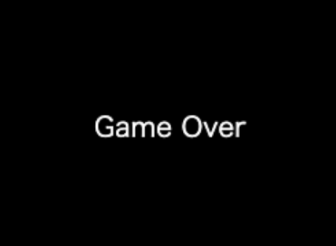

# りんごキャッチ05：ゲームオーバーを作ろう！

## このカリキュラムのゴール  
  
- ルートシーン以外のシーンの作成と切り替えについて学びます  
  
このカリキュラムを終えると以下のような表示になります。  
  

## ゲームオーバーを作ろう！

1. ゲームオーバーのシーンを作ろう  
ゲーム中のシーンは`rootScene`を使っていますが、10秒たったらゲームオーバーの画面を表示します。  
まずはゲームオーバーのシーン（黒画面）を作ります。  

    ```javascript
    var gameOver = new Scene();             // ルートシーンの生成
    gameOver.backgroundColor = 'black';     // 背景色'黒'を設定
    ```

2. ゲームオーバー画面に表示する文字を作ろう  
ゲームオーバーの黒い画面が表示された際に、`"Game Over"`と文字を表示します。  
文字の表示は`Label（ラベル）`を使います。  

    ```javascript
    var goLabel = new Label();
    goLabel.x = 280;
    goLabel.y = 310;
    goLabel.text = 'Game Over';
    goLabel.font = '20px Hiragino';
    goLabel.color = 'white';
    gameOver.addChild(goLabel);
    ```

3. 10秒経過したらゲームオーバー画面を表示しよう  
先ほど時間の表示に使った処理を利用して10秒経過したらゲームオーバーのシーンを表示します。  

    ```javascript
    core.rootScene.on('enterframe', function() {
        time.text = 'Time: ' + ((((TIME * core.fps) - core.frame)) / core.fps).toFixed(0);
        if(core.frame >= (core.fps * TIME) ) {
            core.pushScene(gameOver);       // ゲームオーバーシーンに切り替え
            core.stop();                    // ゲームの動きを止める
        }
    });
    ```

---  

## main.js 完成品

```javascript
// enchant.jsの利用宣言
enchant();

// JavaScriptプログラムを実行する定型文
window.onload = function() {

    // ゲームの残り時間
    const TIME = 10;

    // ゲーム画面の生成
    var core = new Core(640, 640);
    // ネコ画像の読み込み
    core.preload('cat.png');
    // 画面更新間隔の設定
    core.fps = 30;

    // ゲームの処理
    core.onload = function() {

        // ネコスプライトの生成
        var cat = new Sprite(100, 100);
        // ネコ画像の設定
        cat.image = core.assets['cat.png'];
        // ネコの初期座標を設定
        cat.x = 270;
        cat.y = 500;
        // ネコのサイズを設定（0.5倍）
        cat.scaleX = 0.5;
        cat.scaleY = 0.5;
        // ネコの初期コスチュームを設定
        cat.frame = 0;
        // ネコの動き
        cat.on('enterframe', function() {
            // 左キーが押された場合
            if(core.input.left) {
                // コスチュームを切り替え
                this.frame = this.age % 2;
                // 左に移動
                this.x -= 5;
                // 左向きに変更
                this.scaleX = -0.5;
            }
            // 右キーが押された場合
            if(core.input.right) {
                // コスチュームを切り替え
                this.frame = this.age % 2;
                // 右に移動
                this.x += 5;
                // 右向きに変更
                this.scaleX = 0.5;
            }
        });
        // ルートシーンにネコのスプライトを登録
        core.rootScene.addChild(cat);

        // 残り時間ラベルの生成
        var timeLabel = new Label();
        // ラベルの初期位置を設定
        timeLabel.x = 10;
        timeLabel.y = 10;
        // ラベルの文字サイズと種類を設定
        timeLabel.font = '20px Hiragino';
        // ラベルの初期文字を設定
        timeLabel.text = 'Time: ';
        // ルートシーンにラベルを登録
        core.rootScene.addChild(timeLabel);

        // ゲームオーバーシーンの生成
        var gameOver = new Scene();
        // ゲームオーバーシーンの背景を黒に設定
        gameOver.backgroundColor = 'black';

        // ゲームオーバー画面のラベルを生成
        var goLabel = new Label();
        // ラベルの初期位置を設定
        goLabel.x = 280;
        goLabel.y = 310;
        // ラベルの文字を設定
        goLabel.text = 'Game Over';
        // 文字のサイズと種類を設定
        goLabel.font = '20px Hiragino';
        // 文字色（白）を設定
        goLabel.color = 'white';
        // ゲームオーバーシーンにラベルを登録
        gameOver.addChild(goLabel);

        // ルートシーンの動き
        core.rootScene.on('enterframe', function() {
            // 残り時間を表示
            timeLabel.text = 'Time: ' + ((((TIME * core.fps) - core.frame)) / core.fps).toFixed(0);
            // 10秒経過したら
            if(core.frame >= (core.fps * TIME) ) {
                // ゲームオーバーシーンに切り替え
                core.pushScene(gameOver);
                // ゲームを止める
                core.stop();
            }
        });
    }
    // ゲームスタート
    core.start();
}
```

- - -  
©️スタートプログラミング  
  