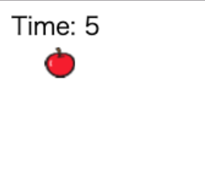

# りんごキャッチ06：りんごを表示してみよう！

## このカリキュラムのゴール  
  
- クラスの定義について学びます
- クラスの実態化（クローン）について学びます
  
    このカリキュラムを終えると以下のような表示になります。  
      

## りんごを表示してみよう！

1. りんごクラスをつくろう  
まずはりんごの画像を利用するため画像読み込みの処理を修正します。  

    ```javascript
    // 修正  
    core.preload('cat.png', 'apple.png');
    ```

    リンゴのスプライトはたくさん作る必要があるため、`クラス` を作成します。  

    ```javascript
    // りんごクラスの定義
    var Apple = Class.create(Sprite, {
        // 初期化
        initialize: function() {
            // スプライトの読み込み
            Sprite.call(this, 100, 100);
            // 初期位置の設定
            this.x = 0;
            this.y = 0;
            // サイズの縮小
            this.scaleX = 0.25;
            this.scaleY = 0.25;
            // 画像の設定
            this.image = core.assets['apple.png'];
            // コスチュームの設定
            this.frame = 0;
            // ルートシーンに登録
            core.rootScene.addChild(this);
        }
    });
    ```

2. りんごを表示しよう  
1.で作ったりんごクラスは型だけで、実際に表示するためにはクローンする必要があります。  
クローンのことを `インスタンス` と呼ぶので覚えておきましょう。  

    ```javascript
    var apple = new Apple();
    ```

## おさらい  

- たくさん同じものを作る場合は`クラス`を定義してコピーする型を作る  
- クラスから作られた実態のことを`インスタンス`と呼ぶ  

--- 

## main.js 完成品（一部省略）


```javascript
// enchant.jsの利用宣言
enchant();

// JavaScriptプログラムを実行する定型文
window.onload = function() {

    // ゲームの残り時間
    const TIME = 10;

    // ゲーム画面の生成
    var core = new Core(640, 640);
    // ネコ画像の読み込み
    core.preload('cat.png', 'apple.png');
    // 画面更新間隔の設定
    core.fps = 30;

    // ゲームの処理
    core.onload = function() {

        // ネコスプライトの生成
        var cat = new Sprite(100, 100);
        // ネコ画像の設定
        cat.image = core.assets['cat.png'];
        // ネコの初期座標を設定
        cat.x = 270;
        cat.y = 500;
        // ネコのサイズを設定（0.5倍）
        cat.scaleX = 0.5;
        cat.scaleY = 0.5;
        // ネコの初期コスチュームを設定
        cat.frame = 0;
        // ネコの動き
        cat.on('enterframe', function() {
            // 左キーが押された場合
            if(core.input.left) {
                // コスチュームを切り替え
                this.frame = this.age % 2;
                // 左に移動
                this.x -= 5;
                // 左向きに変更
                this.scaleX = -0.5;
            }
            // 右キーが押された場合
            if(core.input.right) {
                // コスチュームを切り替え
                this.frame = this.age % 2;
                // 右に移動
                this.x += 5;
                // 右向きに変更
                this.scaleX = 0.5;
            }
        });
        // ルートシーンにネコのスプライトを登録
        core.rootScene.addChild(cat);

        // 残り時間ラベルの生成
        var timeLabel = new Label();
        // ラベルの初期位置を設定
        timeLabel.x = 10;
        timeLabel.y = 10;
        // ラベルの文字サイズと種類を設定
        timeLabel.font = '20px Hiragino';
        // ラベルの初期文字を設定
        timeLabel.text = 'Time: ';
        // ルートシーンにラベルを登録
        core.rootScene.addChild(timeLabel);

        // りんごクラスの定義
        var Apple = Class.create(Sprite, {
            // 初期化
            initialize: function() {
                // りんごスプライトの生成
                Sprite.call(this, 100, 100);
                // スプライトの初期位置の設定
                this.x = 0;
                this.y = 0;
                // サイズの縮小
                this.scaleX = 0.25;
                this.scaleY = 0.25;
                // りんご画像の設定
                this.image = core.assets['apple.png'];
                // コスチュームの設定
                this.frame = 0;
                // ルートシーンに登録
                core.rootScene.addChild(this);
            }
        });
        var apple = new Apple();

        // ゲームオーバーシーンの生成
        var gameOver = new Scene();
        // ゲームオーバーシーンの背景を黒に設定
        gameOver.backgroundColor = 'black';

        // ゲームオーバー画面のラベルを生成
        var goLabel = new Label();
        // ラベルの初期位置を設定
        goLabel.x = 280;
        goLabel.y = 310;
        // ラベルの文字を設定
        goLabel.text = 'Game Over';
        // 文字のサイズと種類を設定
        goLabel.font = '20px Hiragino';
        // 文字色（白）を設定
        goLabel.color = 'white';
        // ゲームオーバーシーンにラベルを登録
        gameOver.addChild(goLabel);

        // ルートシーンの動き
        core.rootScene.on('enterframe', function() {
            // 残り時間を表示
            timeLabel.text = 'Time: ' + ((((TIME * core.fps) - core.frame)) / core.fps).toFixed(0);
            // 10秒経過したら
            if(core.frame >= (core.fps * TIME) ) {
                // ゲームオーバーシーンに切り替え
                core.pushScene(gameOver);
                // ゲームを止める
                core.stop();
            }
        });
    }
    // ゲームスタート
    core.start();
}
```

- - -  
©️スタートプログラミング  
  