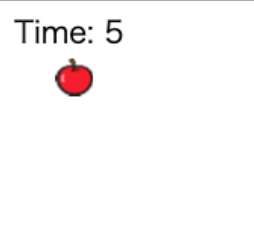

# りんごキャッチ07：

## このカリキュラムのゴール  
  
- 乱数を取得するプログラムを考えます
- 関数の定義の仕方を学びます
  
    このカリキュラムを終えると以下のような表示になります。  
      

## りんごをたくさん落とそう

1. X座標をランダムに設定しよう  
りんごのインスタンスが生成された時にランダムなX座標を設定し、いろんなところからりんごが落ちてくるようにしましょう。  
乱数を取得する仕組みを関数化して使いやすくします。  

    関数の型は以下の通りです。  

    ```javascript
    function 関数名(引数) {
        return;
    }
    ```

    乱数を取得するプログラムは以下の通りです。  

    ```javascript
    function rand(n) {
        return Math.floor(Math.random() * (n + 1));
    }
    ```

    - `Math.random()`：0.0 〜 1.0 までのランダムな小数値を取得します  
    - `Math.floor()`：小数を整数に切り上げます  


2. リンゴを表示してみよう  
さきほど作ったりんごのX座標の設定値に乱数を使います。  
640は画面の横幅ですが、`rand関数`を使うことで、0 〜 640 のいずれかの数字が取得できます。  

    ```javascript
    var Apple = Class.create(Sprite, {
        initialize: function() {
            this.x = rand(640);
        }
    });
    ```
    実装できたら画面更新の度にリンゴのX座標が変わることを確認しましょう。  

3. りんごをたくさん作って落とそう  
一定の間隔でリンゴの生成を行いましょう。  

    ```javascript
    core.rootScene.on('enterframe', function() {
        time.text = 'Time: ' + ((((TIME * core.fps) - core.frame)) / core.fps).toFixed(0);
        if (core.frame % 10 == 0) {
            apples = new Apple();
        }
    });
    ```
    生成されたりんごは自動的に上から下に落ちるよう実装します。  
    また、画面外まで移動したりんごはインスタンスを削除します。

    ```javascript
    var Apple = Class.create(Sprite, {
        initialize: function() {
            this.on('enterframe', function() {
                this.y += 5;
                if (this.y >= 640) {
                    core.rootScene.removeChild(this);
                }
            });
            core.rootScene.addChild(this);
        }
    });
    ```
    
    画面外にスプライトが移動した場合など、不要になったインスタンスは削除するようにしましょう。  
    削除せずインスタンスを生成し続けると、画面外でデータがたまってパソコンが重たくなったりすることがあります。  

## おさらい  

- 乱数はスクラッチと違って自分で実装しなければならない  
- 生成したインスタンスは不要になったタイミングで削除する  

---

## main.js 完成品（一部省略） 

```javascript
// enchant.jsの利用宣言
enchant();

// 乱数を取得します
// Parameters
//   - n: 取得する最大値
// Return:
//   - int: 取得した乱数
function rand(n) {
    return Math.floor(Math.random() * (n + 1));
}

// JavaScriptプログラムを実行する定型文
window.onload = function() {

    // ゲームの残り時間
    const TIME = 10;

    // ゲーム画面の生成
    var core = new Core(640, 640);
    // ネコ画像の読み込み
    core.preload('cat.png', 'apple.png');
    // 画面更新間隔の設定
    core.fps = 30;

    // ゲームの処理
    core.onload = function() {

        // ネコスプライトの生成
        var cat = new Sprite(100, 100);
        // ネコ画像の設定
        cat.image = core.assets['cat.png'];
        // ネコの初期座標を設定
        cat.x = 270;
        cat.y = 500;
        // ネコのサイズを設定（0.5倍）
        cat.scaleX = 0.5;
        cat.scaleY = 0.5;
        // ネコの初期コスチュームを設定
        cat.frame = 0;
        // ネコの動き
        cat.on('enterframe', function() {
            // 左キーが押された場合
            if(core.input.left) {
                // コスチュームを切り替え
                this.frame = this.age % 2;
                // 左に移動
                this.x -= 5;
                // 左向きに変更
                this.scaleX = -0.5;
            }
            // 右キーが押された場合
            if(core.input.right) {
                // コスチュームを切り替え
                this.frame = this.age % 2;
                // 右に移動
                this.x += 5;
                // 右向きに変更
                this.scaleX = 0.5;
            }
        });
        // ルートシーンにネコのスプライトを登録
        core.rootScene.addChild(cat);

        // 残り時間ラベルの生成
        var timeLabel = new Label();
        // ラベルの初期位置を設定
        timeLabel.x = 10;
        timeLabel.y = 10;
        // ラベルの文字サイズと種類を設定
        timeLabel.font = '20px Hiragino';
        // ラベルの初期文字を設定
        timeLabel.text = 'Time: ';
        // ルートシーンにラベルを登録
        core.rootScene.addChild(timeLabel);

        // りんごクラスの定義
        var Apple = Class.create(Sprite, {
            initialize: function() {
                // スプライトを生成
                Sprite.call(this, 100, 100);
                // 初期位置の定義
                this.x = rand(640);
                this.y = 0;
                // サイズの縮小
                this.scaleX = 0.25;
                this.scaleY = 0.25;
                // りんご画像の設定
                this.image = core.assets['apple.png'];
                // コスチュームの設定
                this.frame = 0;
                // りんごの動き
                this.on('enterframe', function() {
                    // 下に移動
                    this.y += 5;
                    // 画面外に出た場合
                    if (this.y >= 640) {
                        // ルートシーンからりんごスプライトを削除する
                        core.rootScene.removeChild(this);
                    }
                });
                core.rootScene.addChild(this);
            }
        });

        // ゲームオーバーシーンの生成
        var gameOver = new Scene();
        // ゲームオーバーシーンの背景を黒に設定
        gameOver.backgroundColor = 'black';

        // ゲームオーバー画面のラベルを生成
        var goLabel = new Label();
        // ラベルの初期位置を設定
        goLabel.x = 280;
        goLabel.y = 310;
        // ラベルの文字を設定
        goLabel.text = 'Game Over';
        // 文字のサイズと種類を設定
        goLabel.font = '20px Hiragino';
        // 文字色（白）を設定
        goLabel.color = 'white';
        // ゲームオーバーシーンにラベルを登録
        gameOver.addChild(goLabel);

        // ルートシーンの動き
        core.rootScene.on('enterframe', function() {
            // 残り時間を表示
            timeLabel.text = 'Time: ' + ((((TIME * core.fps) - core.frame)) / core.fps).toFixed(0);

            // 一定間隔
            if (core.frame % 10 == 0) {
                // りんごをクローンする
                apples = new Apple();
            }

            // 10秒経過したら
            if(core.frame >= (core.fps * TIME) ) {
                // ゲームオーバーシーンに切り替え
                core.pushScene(gameOver);
                // ゲームを止める
                core.stop();
            }
        });
    }
    // ゲームスタート
    core.start();
}
```

- - -  
©️スタートプログラミング  
  