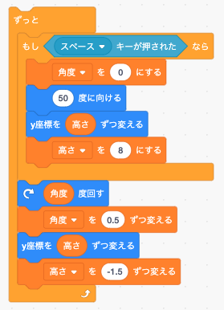
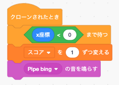

# （課題）フラッピーバード：ヒント  

りんごキャッチゲームが完成したところで、２つ目の課題はフラッピーバードというゲームです。  
基本的なゲーム開発の仕方はりんごキャッチと同じため、新たな機能の利用などに絞ってサンプルのコードでヒントを提供します。  

## 目次

- **ファイルのフォルダ分け**  
  画像ファイルや音ファイルの読み込みで利用します。  

- **スペースキーの割り当て**  
  スプライトが飛ぶ動作で利用します。  

- **シーンのライフサイクル**  
  画面遷移で利用します。  

- **スプライトの当たり判定**  
  鳥と地面や土管との当たり判定に利用します。  

- **土管画像の表示**  
  上下に土管を並べる表示に利用します。    

- **クラスインスタンス生成時のパラメータ**  
  土管生成時に利用します。  

- **鳥が飛ぶ動作**  
  鳥スプライトの飛ぶ動作についてプログラムの考え方を解説しています。  

- **得点のカウント**  
  鳥が土管を通ると得点をカウントするプログラムについて考え方を解説しています。  

- **シーンの移動**  
  ゲームオーバーから最初の画面に遷移する時に利用します。  

## ファイルのフォルダ分け  

ソースファイルだけでなく、画像ファイルや音ファイルなど、同じフォルダ内にファイルが増えてくるとフォルダの中が整理されておらずファイルが探しづらくなります。  
そんな時にはフォルダを新規作成してファイルを整理しましょう。  

フラッピーバードでは画像系のフォルダを `res` 、音系のファイルを `sound` というフォルダの中に入れています。  

```
application 
    | - res
    |   |  - flappy.png
    |   |  - ground.png
    |   |  - pipe.png
    |   |  - score.png
    |   |  - screen.png
    |   |  - title.png
    |  
    | - sound
    |   |  - bing.png
    |   |  - dead.png
    |   |  - flap.png
    |  
    | - enchant.min.js 
    | - index.html
    | - main.js
```

このようにソースファイル・画像系ファイル・音系ファイルの3つに分けることでわかりやすくなりました。  
ただし、プログラムから呼び出す場合は注意が必要です。  

`main.js` で画像を読み込む際、`main.js` からみて画像ファイルや音ファイルの位置（パスといいます）を指定する必要があります。  

- main.jsと同じ階層に読み込みたいファイルがある場合  
```javascript
const IMG_FLAPPY = 'flappy.png';
const SOUND_FLAP = 'flap.wav';
```

通常上記のようにファイル名を指定すればよかったのですが、フォルダに入れた場合は、下記の通りパスを指定する必要がありますので注意しましょう。  

- main.jsとは違う階層に読み込みたいファイルがある場合  
```javascript
const IMG_FLAPPY = 'res/flappy.png';
const SOUND_FLAP = 'sound/flap.wav';
```
  
## スペースキーの割り当て  

左右キーが押された時などは通常以下の方法でキーの押下を判断できます。  

```javascript
core.rootScene.on('enterframe', function() {
    // 左キーが押された時
    if (core.input.left) {
    }
});
```

フラッピーバードでは、スペースキーが押された時に鳥のキャラクターが飛ぶ動きをしますが、`enchant.js` は初期設定のままスペースキーを使うことができません。  
スペースキーをゲームの入力で扱うには、coreオブジェクトにキーの登録を行う必要があります。  
  
```javascript
// スペースキーの利用設定
core.keybind(32, "space");
```
  
上記の登録を行うことで、左右キーのようにスペースキーを扱うことができます。  

```javascript
core.rootScene.on('enterframe', function() {
    // スペースキーが押された時
    if (core.input.space) {
    }
});
```
  
## シーンのライフサイクル  
  
画面（シーン）にはライフサイクルと呼ばれる画面表示から画面終了までの処理の流れがあります。  
画面の初期表示、処理中、終了という3つの画面の状態の変化をライフサイクルと呼びます。  

- `enter`：画面の初期表示時に最初に1度だけ処理されるメソッド  
画面が表示された時、最初に1度だけ行いたい処理（初期化など）を行うために利用します。  

```javascript
var flappy = new Sprite(40, 40);
flappy.image = core.assets[IMG_FLAPPY];

// 画面の初期表示
core.rootScene.on('enter', function() {
    // 位置の調整
    flappy.x = 100;
    flappy.y = 100;
    // コスチュームを設定
    flappy.frame = 0;
    // ルートシーンにスプライトを登録
    core.rootScene.addChild(flappy);
});
```
  
- `enterframe`：画面の表示開始から終了まで処理が繰り返されるメソッド  
スプライトのキー操作など、画面が表示されて終了されるまでの処理を行うために利用します。  
  
```javascript
// 画面表示中の処理
core.rootScene.on('enterframe', function() {
    // スペースキーが押された時
    if (core.input.space) {
        // 羽ばたく
    }
});
```  
  
- `exit`：画面の終了時に最後に1度だけ処理されるメソッド  
ゲームオーバーになった場合など、画面を終了して次の画面に遷移する時、終了するために必要な処理を行うために利用します。  

```javascript
// 画面終了時の処理
core.rootScene.on('exit', function() {
    // ルートシーンからスプライトを削除
    core.rootScene.removeChild(flappy);
});
```

## スプライトの当たり判定  

りんごキャッチではスプライト（りんごとネコ）の当たり判定に `within` メソッドを利用しました。  

```javascript
if (this.within(スプライト名, 30)) {
    // 当たった時の処理
}
```

`within`ではスプライト同士の中心点でどのぐらいの距離に近づいたら当たったことにするかという設定で判定しています。  
上記の場合、りんごとネコの中心点が30以内という数値になれば当たったと判断されます。    
  
[APIリファレンス（within）](http://wise9.github.io/enchant.js/doc/core/ja/symbols/enchant.Entity.html#within)  
  
りんごもネコも正方形に収まる形なので中心同士を比較する `within` を使いましたが、フラッピーバードの場合は鳥と地面（長方形）、鳥と土管（長方形）の比較になるため中心点ではうまく判定できません。  

そのため、フラッピーバードはスプライト同士の矩形（全体）がどこかに触れた時点で当たったと判断する `intersect` を利用します。  

[APIリファレンス（intersect）](http://wise9.github.io/enchant.js/doc/core/ja/symbols/enchant.Entity.html#intersect)  

```javascript
if (this.intersect(スプライト名)) {
    // 当たった時の処理
}
```

## 土管画像の表示  

フラッピーバードで用意された土管画像（`pipe.png`）は1パターンしかありません。  
ゲームでは上下に設置されて画面に表示されますが、これは片方の土管を2つ生成し、一つはひっくり返す方法で実装しています。  
用意された土管画像は下に設置するデザインとなっているので、上の土管を作るには画像を縦方向に反転させます。  

```javascript
// 縦にひっくりかえす
this.scaleY = -1;
```

また、なぜあらかじめ上下に設置された1つの土管画像で用意しないのかですが、上下の土管の間に透明なスペースを入れた1つの画像を作ってもプログラム的には `intersect` で透明部分も当たったと判断されてしまうからです。  

## クラスインスタンス生成時のパラメータ  
クラスからインスタンスを生成した際、パラメータ（引数）を渡すことができます。  
フラッピーバードは上・下の土管の縦の位置が一定ではありません。  
上・下ともに同じだけ縦方向の位置をずらす必要がありますので、インスタンスを生成する時に縦方向の移動距離をパラメータ（引数）として渡しましょう。  

```javascript
var Pipe = Class.create(Sprite, {
    initialize: function(posY) {
        // 初期処理
    }
});
var pipe = new Pipe(10);
```

上記ではインスタンス生成時に設定した引数（10）が、`posY`として利用できます。  

## 鳥が飛ぶ動作  
  

鳥の飛ぶ動作を自然に見せるには重力の概念を加える必要があります。  
スクラッチで実際に動作させたプログラムを参考にしてください。  

## 得点のカウント  
  
  
鳥が土管を飛び越えると音が鳴り得点がカウントされます。  
動きだけ見ると鳥が土管を飛び越えているように見えますが、実際は土管が右から左に移動し鳥を通り過ぎているので、土管の位置が鳥を飛び越したところで得点をカウントしています。  

## シーンの移動

フラッピーバードでは、開始画面・ゲーム画面・ゲームオーバー画面の3つの画面があります。  
ゲームオーバー画面に遷移したあと、キーを押すことで再度ゲームが初めからはじまります。  

シーンの移動には以下の3パターンがありますので、うまく使い分けるようにしましょう。  

- 次のシーンに遷移  
```javascript
core.pushScene(シーン名);
```

- 一つ前のシーンに遷移  
```javascript
core.popScene();
```

- 特定のシーンに遷移  
```javascript
core.replaceScene(シーン名);
```

- - -  
©️スタートプログラミング  
  